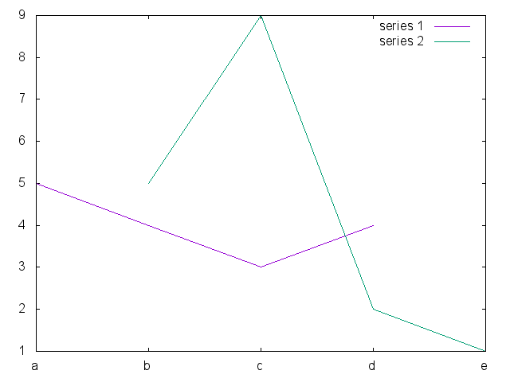

# GnuPlotSharp

Simple C# wrapper around gnuplot.

## Examples
```csharp
new GnuPlotScript("With string labels").Render("printme4.png", new Row<string, int>("series 1", new[] { "a", "b", "c", "d" }, new[] { 5, 4, 3, 4 }), new Row<string, int>("series 2", new[] { "e", "b", "c", "d" }, new[] { 1, 5, 9, 2 }));
```

