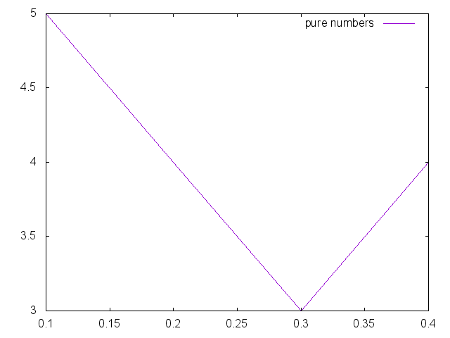

# GnuPlotSharp

Simple C# wrapper around gnuplot.

## Examples
```csharp
 new GnuPlotScript("With string labels")
                .Render(
                    outputfile: "printme4.png",
                    new Row<string, int>("series 1", new[] { "a", "b", "c", "d" }, new[] { 5, 4, 3, 4 }), 
                    new Row<string, int>("series 2", new[] { "e", "b", "c", "d" }, new[] { 1, 5, 9, 2 }));
```


```csharp
new GnuPlotScript("pure numbers").Render(
                outputfile: "printme5.png",
                rows: new Row<double, int>("pure numbers", new[] { 0.1, 0.2, 0.3, 0.4 }, new[] { 5, 4, 3, 4 }));
```
